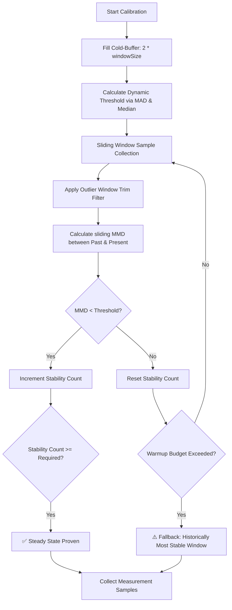

# Unified Implementation Plan: Benchmark Harness Modernization with KBSSD

This document tracks our modernization progress for `package:benchmark_harness`. It integrates the core KBSSD math engine with compositional APIs, subprocess execution pipelines, and the validation diagnostics described in [developer_experience.md](file:///Users/kevmoo/github/tools/pkgs/benchmark_harness/conductor/developer_experience.md).

---

## Status Emojis Key
* `✅` **Completed**
* `🔄` **In-Progress / Partially Completed** (Core is done, missing advanced DX features)
* `⏳` **Not-Started**

---

## 🔄 Phase 1: Dependencies, Foundations & Test Stubbing

We establish standard descriptive statistics models and stub out target developer experiences.

* [x] `✅` **Dependencies Integration**: Ensure `package:stats` is integrated into [pubspec.yaml](file:///Users/kevmoo/github/tools/pkgs/benchmark_harness/pubspec.yaml).
* [x] `✅` **Result Models ([result.dart](file:///Users/kevmoo/github/tools/pkgs/benchmark_harness/lib/src/result.dart))**:
  * [x] `isStable` field tracking mathematical convergence.
  * [x] `convergenceThreshold` tracking dynamic relative convergence limits.
  * [x] `cv` (Coefficient of Variation) computation.
  * [x] `samples` raw list preservation.
* [ ] `⏳` **Integration Test Fixtures**:
  * [ ] Create bad generic argument and invalid generic type fixtures.
  * [ ] Create duration violation fixtures (run loops < 10us or > 200ms).

---

## ✅ Phase 2: Noise-Resilient KBSSD Engine ([runner.dart](file:///Users/kevmoo/github/tools/pkgs/benchmark_harness/lib/src/runner.dart))

The benchmarking engine employs a self-calibrating **Kernel-Based Steady-State Detection (KBSSD)** engine during its warmup phase:

* [x] `✅` **Sliding-Window Structure**: Dual past/present sliding windows with safe dynamic window sizing based on `maxSamples` budgets.
* [x] `✅` **Trim Filter**: Trim a configurable percentage (default `10%`) of extreme values before MMD convergence calculations.
* [x] `✅` **Dynamic Threshold Calibration**: Relative Median Absolute Deviation (MAD) calculation over the initial cold-buffer.
* [x] `✅` **MMD Convergence Math**: Complete Maximum Mean Discrepancy implementation with dynamic sigma scaling.
* [x] `✅` **SEM Convergence Fallback**: Standard Error of the Mean practical convergence check.
* [x] `✅` **Patience Budget & Fallback**: Graceful budget timeouts with a fallback to the historically most stable window.
* [x] `✅` **Workload Operational Guidelines & Calibration Guards**:
  * [x] Warmup calibration phase checking if a single `run()` is under 1ms (warning) or under 10us / over 200ms (abort).
  * [x] Support for the `--force-run` CLI flag and API parameter to bypass safety aborts.

---

## ✅ Phase 3: Compositional API & Legacy Compatibility ([benchmark.dart](file:///Users/kevmoo/github/tools/pkgs/benchmark_harness/lib/src/benchmark.dart))

* [x] `✅` **Compositional Core**: `Benchmark` and `BenchmarkVariant` classes supporting execution of custom sync/async run closures.
* [x] `✅` **DX Advanced Features**:
  * [x] Add optional variant-level `setup` and `teardown` closures to `BenchmarkVariant`.
  * [x] Orchestrate variant lifecycle execution before and after timing sweeps.
* [x] `✅` **Legacy Compatibility**:
  * [x] Deprecate `warmup()` with `@Deprecated(...)` in `BenchmarkBase` and `AsyncBenchmarkBase`.
  * [x] Invoke `warmup()` once in `measure()` for subclass compatibility.
  * [x] Strongly typed method signatures replacing dynamic invokes.

---

## ✅ Phase 4: Enhanced Reporting & CI/CD Integration ([report.dart](file:///Users/kevmoo/github/tools/pkgs/benchmark_harness/lib/src/report.dart))

* [x] `✅` **Statistical Reliability Warnings**: Print warnings to `stderr` if `cv > 20%` or `isStable == false`.
* [x] `✅` **JsonEmitter Stats Expansion**: Include `cv`, `mean`, `median`, `stdDev`, `samples`, `isStable`, and `convergenceThreshold`.
* [x] `✅` **Standardized Metadata Root Schema**:
  * [x] Restructure JSON output to match the `developer_experience.md` schema (including OS environment, timestamp, and warmup diagnostics).

---

## ✅ Phase 5: CLI Tool & Subprocess Execution ([bench.dart](file:///Users/kevmoo/github/tools/pkgs/benchmark_harness/bin/bench.dart))

* [x] `✅` **Multi-Platform Compilation & Executions**: JIT, AOT, JS, and WASM targets executed in isolated subprocesses.
* [x] `✅` **CI Stability Guard**: Implement the `--fail-on-unstable` flag to exit with a non-zero code on unstable runs.
* [x] `✅` **Generative Compilation Wrappers**:
  * [x] Dynamically generate temporary wrappers to import the user's library-level `final List<Benchmark> benchmarks` list for isolation.
* [x] `✅` **Isolate-Mode Optimization**:
  * [x] Add the `--isolate-mode` CLI flag to run JIT sweeps in parallel Dart isolates rather than forking subprocesses.

---

## ✅ Phase 6: Validation Subcommand (`bench validate`)

* [x] `✅` **Validation Framework**:
  * [x] Implement the `validate` subcommand in the CLI options parser.
  * [x] Verify setup, run, and teardown routines across all runtimes.
  * [x] Flag dead-code optimizations (under 1ns runtime) and duration jitter.

---

## ✅ Phase 7: Verification & Quality Checks

* [x] `✅` **Backwards Compatibility Verification**: All legacy tests pass successfully.
* [x] `✅` **Code Quality**: Clean `dart analyze` (0 warnings) and standard formattings.
