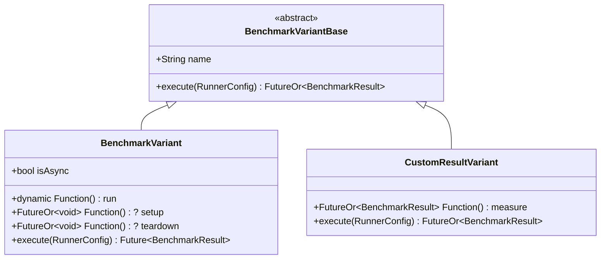

# Abstract Process Coordination Design Roadmap

Rather than baking a heavy, complex HTTP server/client orchestration engine into the core `package:benchmark_harness`, we can support out-of-process and multi-process benchmarks by providing **abstract hooks** inside the compositional API.

This keeps the core SDK package lightweight, generic, and dependency-free, while enabling infinite flexibility for developers to benchmark servers, databases, or external scripts.

---

## 1. The Problem: Automatic Timing Loops

Currently, the compositional `Benchmark` API assumes it must internally time the execution duration of the variant's `run` closure:

```dart
// In Benchmark.run():
final runner = BenchmarkRunner(variant.name, config: config);
results.add(runner.run(variant.run));
```

For external process benchmarks (such as shelf HTTP servers driven by `wrk` load generators), the harness shouldn't time the runner execution itself (which would just measure the total duration of the load run, e.g. 10 seconds). Instead, the benchmark needs to execute its own load test, collect internal throughput/latency samples, and **supply its own pre-measured results** directly to the harness.

---

## 2. The Solution: Polymorphic Encapsulation (`BenchmarkVariantBase`)

We can solve this cleanly by re-rooting our variant hierarchy under a lightweight, single-responsibility abstract base class. 

To prevent class pollution and ensure maximum state safety, **lifecycles (setup/teardown) are fully encapsulated inside the concrete subclasses** rather than declared at the root level. This gives custom process-coordinated benchmarks the freedom to manage their own subprocess handles using compile-safe, lexically-isolated `try-finally` blocks.



### Proposed API Structure

#### 1. The Abstract Root Class (`BenchmarkVariantBase`)
Declares the single-responsibility contract that every task variant must support:
```dart
abstract class BenchmarkVariantBase {
  final String name;

  const BenchmarkVariantBase({required this.name});

  /// Executes the variant and returns its definitive [BenchmarkResult].
  FutureOr<BenchmarkResult> execute(RunnerConfig config);
}
```

#### 2. Concrete Class 1: `BenchmarkVariant` (Standard Timing Loop)
Maintains backward-compatibility for standard, in-process, timed closures, encapsulating its setup/teardown lifecycle wrappers completely:
```dart
class BenchmarkVariant extends BenchmarkVariantBase {
  final dynamic Function() run;
  final FutureOr<void> Function()? setup;
  final FutureOr<void> Function()? teardown;

  BenchmarkVariant({
    required super.name,
    required this.run,
    this.setup,
    this.teardown,
  });

  /// Whether this variant is asynchronous.
  bool get isAsync => run is Future<dynamic> Function();

  @override
  Future<BenchmarkResult> execute(RunnerConfig config) async {
    if (setup != null) {
      await setup!();
    }
    try {
      final runner = BenchmarkRunner(name, config: config);
      if (isAsync) {
        return await runner.runAsync(run as Future<dynamic> Function());
      } else {
        return runner.run(run as void Function());
      }
    } finally {
      if (teardown != null) {
        await teardown!();
      }
    }
  }
}
```

#### 3. Concrete Class 2: `CustomResultVariant` (Abstract Process Bypass)
A lightweight class built specifically to enable external process timing and return custom metric lists. It requires no boilerplate setup/teardown closure mappings, allowing clean lexical scoping:
```dart
class CustomResultVariant extends BenchmarkVariantBase {
  final FutureOr<BenchmarkResult> Function() measure;

  CustomResultVariant({
    required super.name,
    required this.measure,
  });

  @override
  FutureOr<BenchmarkResult> execute(RunnerConfig config) => measure();
}
```

---

## 3. Clean Polymorphic Orchestration

By delegating all setup, teardown, and timing mechanics entirely to the variant classes themselves, `Benchmark.run()` becomes a single, flat, beautiful loop completely free of custom type-assertions or lifecycle orchestration:

```dart
class Benchmark {
  final String title;
  final List<BenchmarkVariantBase> variants; // Polymorphically typed
  final RunnerConfig config;

  Benchmark({
    required this.title,
    required this.variants,
    this.config = const RunnerConfig(),
  }) : assert(variants.isNotEmpty, 'At least one variant must be provided');

  /// Runs all variants polymorphically and returns their results.
  Future<List<BenchmarkResult>> run() async {
    final results = <BenchmarkResult>[];
    for (final variant in variants) {
      // Absolute separation of concerns: the orchestrator simply delegates execution!
      results.add(await variant.execute(config));
    }
    return results;
  }
}
```

---

## 4. Case Study: Orchestrating a Server Benchmark

Using the `CustomResultVariant` hook, a developer can build a high-performance HTTP benchmark in their own application code. All subprocess handles are **100% lexically isolated** inside the `measure` closure, using standard `try-finally` blocks for guaranteed compile-safe cleanup:

```dart
import 'dart:io';
import 'package:benchmark_harness/benchmark_harness.dart';

void main() async {
  final serverBenchmark = Benchmark(
    title: 'HTTP Server Sweep',
    variants: [
      CustomResultVariant(
        name: 'Shelf / GET user',
        measure: () async {
          // 1. Spawn the background server process
          final server = await Process.start('dart', ['bin/server.dart']);
          
          try {
            // 2. Active TCP Port Probing connect loop
            await _probePort(8080);
            
            // 3. Spawn wrk load generator, capturing 1-second interval throughput rates
            final wrk = await Process.run('wrk', ['-d3s', 'http://localhost:8080/user']);
            final samples = _parseWrkThroughputs(wrk.stdout);
            
            // 4. Return pre-measured results straight to the harness
            return BenchmarkResult(
              name: 'Shelf / GET user',
              samples: samples, // E.g., [45000.0, 48000.0, 46200.0] reqs/sec
            );
          } finally {
            // 5. Guaranteed cleanup: kill the server process cleanly in all scenarios
            server.kill();
          }
        },
      ),
    ],
  );

  // Runs and formats natively!
  await serverBenchmark.report();
}
```
