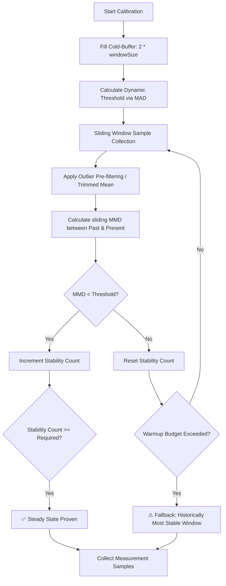

# Unified Modernization Plan - benchmark_harness with KBSSD

This document integrates the core modernization strategy with the advanced,
noise-resilient Kernel-Based Steady-State Detection (KBSSD) patterns.

## 1. Architectural Objective

To establish `package:benchmark_harness` as a highly reliable,
production-grade benchmarking framework capable of delivering mathematically
sound performance analysis across JIT, AOT, JS, and WASM targets, even when
executed in highly noisy virtualization and CI environments (e.g., GitHub
Actions, GCP Cloud Build).

We achieve this by combining:
1. **Compositional APIs** to support multiple task variants and easy
   comparisons.
2. **Package Stats Integration** for standard descriptive statistics (mean,
   median, standard deviation, confidence intervals).
3. **Self-Calibrating KBSSD (Kernel-Based Steady-State Detection)** as the
   standard warmup strategy, featuring sliding-window Maximum Mean
   Discrepancy (MMD), outlier pre-filtering, dynamic thresholding, and
   patience budget fallback mechanisms.

---

## 2. Unified Implementation Phases

### Phase 1: Dependencies & Foundations
1. **Integrate `package:stats`**: Add `package:stats` to `pubspec.yaml` for
   standardized mathematical tools.
2. **Result Models (`lib/src/result.dart`)**:
   - Define structured classes to capture raw metrics, execution platform
     metadata, and statistical representations.
   - Provide standard serialization support to enable cross-platform analysis.

### Phase 2: Noise-Resilient Adaptive Engine (`lib/src/runner.dart`)
Rather than simple iterations or arbitrary time-based warmups, the harness will
employ a self-calibrating KBSSD engine:



1. **Adaptive Calibration**: Fill the initial cold-buffer (first
   $2 \times \text{windowSize}$ samples), calculate the Mean Absolute Deviation
   (MAD), and dynamically compute the target convergence threshold relative to
   local background noise.
2. **Outlier Pre-Filtering**: Implement a sliding-window trimmed mean or
   median filter to strip out high-frequency timing spikes (e.g., OS
   scheduling context switches, background GC) before feeding samples to the
   convergence engine.
3. **Mathematical Convergence via KBSSD**:
   - Compare the `Past` and `Present` sliding windows using Maximum Mean
     Discrepancy (MMD).
   - Halt warmup once a stable window sequence is detected, or fall back to a
     **Practical Steady State** utilizing the Standard Error of the Mean (SEM):
     $$\text{Width} = 1.96 \times \text{SEM} \le 0.03 \times \text{Mean}$$
4. **Patience Budget & Best-Effort Fallback**:
   - Enforce a hard budget limit (e.g., maximum 200 samples or 5 seconds).
   - If the budget is exceeded without mathematical proof of convergence,
     fall back to the historically most stable window (lowest recorded MMD
     score) and emit a warning regarding environmental noise.

### Phase 3: Modern Compositional API (`lib/src/benchmark.dart`)
1. **Composition over Inheritance**:
   - Define `BenchmarkVariant` to hold a specific executable task variation
     (e.g., different data structures, sync or async operations).
   - Define `Benchmark` to orchestrate variant execution, direct comparisons,
     and timing calibration.
2. **Backward Compatibility**:
   - Maintain structural compatibility by wrapping legacy `BenchmarkBase` and
     `AsyncBenchmarkBase` interfaces around the new `BenchmarkRunner` pipeline.

### Phase 4: Enhanced Reporting & CI/CD Integration (`lib/src/report.dart`)
1. **Rich Emitters**:
   - Extend `ScoreEmitter` to pass detailed statistical profiles (`Stats`
     objects) instead of raw single-number scores.
   - Implement a structured `JsonEmitter` targeting CI/CD regressions and
     multi-platform performance dashboards.
2. **Reliability Flagging**:
   - Automatically flag benchmark results with high coefficients of variation
     (CV%) or wide confidence intervals as "statistically unreliable" or
     "insufficiently stable."

### Phase 5: CLI Tool & Platform Aggregation (`bin/bench.dart`)
1. **Structured Aggregator**:
   - Update the `bench.dart` tool to run tests across all target compilation
     modes (JIT, AOT, JS, WASM).
   - Consolidate JSON outputs to produce a combined comparison report showing
     ratios and stability ratings.

## 3. Delta Comparison & Regression Analysis (Future Phase)

To support developer workflows comparing local modifications (before/after a
change in the `lib/` directory), we will implement delta analysis.

This phase will be deferred until Phases 1-5 are complete and the engine is
producing reliable, robust metrics. We will support two primary comparison
strategies:

### 1. Baseline-File Mode (Low-Risk, Recommended)
* **Workflow**:
  1. Run the benchmark on the baseline branch/commit and save results:
     ```bash
     dart run benchmark_harness:bench run --save-baseline=before.json
     ```
  2. Make the code edits in the `lib/` directory.
  3. Run the benchmark against the active workspace and compare:
     ```bash
     dart run benchmark_harness:bench compare before.json
     ```
* **Pros**: Zero risk of git workspace disruption; highly predictable; easy for
  developers to run manually.

### 2. Git-Orchestrated Mode (Automated Controller)
* **Workflow**: Run a controller command specifying a git ref to compare:
  ```bash
  dart run benchmark_harness:bench compare --against=main
  ```
* **Orchestration**: The tool automatically:
  1. Stashes any uncommitted local changes.
  2. Checks out `main`, runs the target benchmarks, and saves the baseline.
  3. Restores the workspace branch and applies the stashed changes.
  4. Runs the active workspace benchmarks and outputs a speedup/regression
     ratio report.

### 3. Delta Report & Regression Flagging
* Leverage calculated confidence intervals from Phase 1 to highlight
  statistically significant performance improvements or regressions, minimizing
  false-alarm CI triggers.
