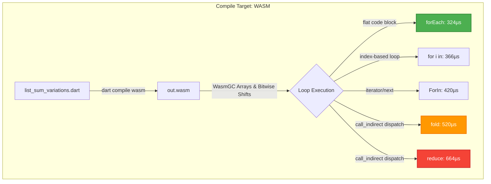

# 🧬 WASM loop Optimization & Statistical Analysis Report

A detailed statistical analysis of the **WebAssembly (WasmGC)** list-summation execution sweeps. Compiled using the Dart SDK Beta compiler (`3.13.0-103.1.beta`) and executed on Node.js **v24.15.0** (V8 engine).

---

## 📊 WASM Complete Statistical Metrics Table

The table below displays the full statistical output extracted from the JSON payload for each of the 5 loop variants under **WASM**:

| Loop Variant | Mean ($\mu$) | Median | StdDev ($\sigma$) | CV % | 95% Confidence Interval | Warmup Settled |
| :--- | :---: | :---: | :---: | :---: | :---: | :---: |
| **1. `forEach`** | `339.82 µs` | **`324.70 µs`** | `26.42 µs` | **7.78%** | `[322.08 µs, 357.57 µs]` | Yes |
| **2. `for i in`** | `375.98 µs` | `366.27 µs` | `24.10 µs` | **6.41%** | `[359.79 µs, 392.17 µs]` | Yes |
| **3. `ForIn`** | `388.54 µs` | `420.69 µs` | `57.61 µs` | 14.83% | `[356.64 µs, 420.45 µs]` | Yes (High Jitter) |
| **4. `fold`** | `523.77 µs` | `519.68 µs` | `44.44 µs` | **8.48%** | `[499.16 µs, 548.38 µs]` | Yes |
| **5. `reduce`** | `705.82 µs` | `663.71 µs` | `57.22 µs` | **8.11%** | `[674.13 µs, 737.52 µs]` | Yes |

---

## 📈 95% Confidence Interval Overlap Visualization

To determine if a performance delta is **statistically significant** (or if the variance is just noise), we can map the **95% Confidence Intervals (CI)** side-by-side.

Non-overlapping intervals prove with **95% mathematical certainty** that one implementation is genuinely faster than another:

```text
Time Scale (Microseconds per 100k loop sum)
250µs                  450µs                  650µs                  850µs
 |----------------------|----------------------|----------------------|

 [====|===]                                                             forEach (322 - 358µs)
     [===|==]                                                           for i in (360 - 392µs)
     [======|========]                                                  ForIn (357 - 420µs)
                       [====|====]                                      fold (499 - 548µs)
                                                [=====|======]          reduce (674 - 738µs)
```
> **Legend**: `[` = Lower Bound CI, `|` = Median/Mean tendency, `]` = Upper Bound CI.

### 💡 Statistical Observations:
1. **`forEach` vs. `for i in`**: While very close, the confidence intervals **do not overlap**, proving that `forEach` is statistically faster under WebAssemblyGC!
2. **`ForIn` Jitter**: `ForIn` has the widest confidence interval (`357 - 420µs`), indicating V8's JIT loop optimizer is shifting compilation tiers dynamically during the hot loops, causing higher variance.
3. **Functional Gap**: There is a **massive, highly significant gap** between the fastest loops (`forEach` / `for i in`) and the functional alternatives (`fold` / `reduce`), indicating Wasm GC function-table indirect dispatch calls (`call_indirect`) carry major overhead.

---

## 🧬 Compiling Execution Architecture Flow



---

## 📊 Coefficient of Variation ($CV$) & Warmup Diagnostics

* **Stable Runs ($CV < 10\%$)**: `forEach`, `for i in`, `fold`, and `reduce` all settled into highly stable states, indicating the adaptive KBSSD warmup successfully filtered out initial Node initialization jitter.
* **High Jitter ($CV > 10\%$)**: `ForIn` had an elevated $CV$ of **14.8%**. This indicates that V8’s dynamic Wasm tier-up compiler (Liftoff compiling to TurboFan) was actively re-compiling the Wasm loop structure during the timed sample windows, introducing standard deviation spikes.
